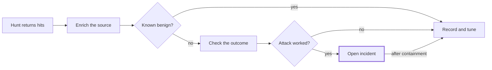

# Cloudflare WAF Threat Hunting Playbook

_Last updated: 2026-09-28_

## Contents

- [Purpose and scope](#purpose-and-scope)
- [Data sources and prerequisites](#data-sources-and-prerequisites)
- [Field reference](#field-reference)
- [Hunt catalogue](#hunt-catalogue)
- [Triage and escalation workflow](#triage-and-escalation-workflow)
- [Turning findings into Cloudflare rules and detections](#turning-findings-into-cloudflare-rules-and-detections)
- [Cadence, metrics and pitfalls](#cadence-metrics-and-pitfalls)
- [Sources](#sources)

## Purpose and scope

This playbook finds attacks that Cloudflare let through, not the ones it already stopped. Blocks are failed attempts; the hunt targets allowed requests that look malicious, sources that mutate payloads until they pass, and campaigns that stay below every threshold.

It covers zones proxied through Cloudflare (orange-cloud) with WAF, Bot Management and Logpush. Each hunt has a hypothesis, a query, triage notes and a response. Queries are written in generic SQL against the Logpush `http_requests` dataset; adapt table and field names to your SIEM or data lake.

Every hunt ends in one of three outcomes: an incident, a new rule or detection, or a documented negative result.

## Data sources and prerequisites

Hunting needs full `http_requests` logs, not the dashboard. Security Analytics and Security Events views are good for pivoting, but they are sampled and have short retention.

| Source | What it gives you | Use it for |
| --- | --- | --- |
| `http_requests` (Logpush, zone) | Every request with security verdict, scores, fingerprints, edge and origin status, bytes | Primary hunting dataset |
| `firewall_events` (Logpush, zone or account) | Only requests a security product acted on or logged, with the matching rule | Rule-level analysis, near-miss hunting |
| Account Abuse Protection Events | Authentication events with user ID, email risk, JA4 | Account takeover and fake-account hunts |
| `websocket_analytics` | Per-connection WebSocket stats, joinable by RayID | Abuse of real-time channels |
| Log Explorer | Cloudflare-hosted SQL over the same datasets | Quick hunts without a SIEM |
| Origin and app logs | Auth results, user IDs, business events | Proving whether an attack succeeded |

The account-scoped `firewall_events` dataset (added June 2026) lets one Logpush job cover every zone, with a `ZoneName` field to tell them apart ([Cloudflare Logs changelog](https://developers.cloudflare.com/logs/changelog/logs/)).

### Prerequisites checklist

- [ ] Logpush `http_requests` enabled for every production zone, with all security, bot, TLS and origin fields selected
- [ ] Custom fields configured to log key request headers (for example `X-Forwarded-For`, `Authorization` presence only, `Content-Type`, `sec-ch-ua`) and response headers you need
- [ ] Retention of at least 90 days hot and 12 months cold, for CVE retro-hunts
- [ ] Timestamps set to `rfc3339ms` or `unixnano` so events order correctly
- [ ] Origin locked to Cloudflare only (Authenticated Origin Pulls, Cloudflare Tunnel, or firewall allow-list of Cloudflare IPs)
- [ ] Origin logs capture `CF-Connecting-IP` and `CF-Ray` so they join back to Cloudflare logs
- [ ] Managed Rules and OWASP rules have at least some rules in Log mode, so near-misses are visible
- [ ] Sentinel users on the Codeless Connector Framework connector; the Azure Functions connector lost support on 2026-09-14 ([changelog](https://developers.cloudflare.com/logs/changelog/logs/))

### Joining sources

`RayID` is the join key between Cloudflare datasets and your origin logs. `ClientIP` in Cloudflare logs is the real client, so do not re-derive it from `X-Forwarded-For`, which the client controls.

## Field reference

These `http_requests` fields carry most hunts. Field availability depends on plan and add-ons (Bot Management, leaked credential detection, API Shield); run the Logpush available-fields API to confirm what your zones emit.

| Field | Meaning | Hunting use |
| --- | --- | --- |
| `ClientIP`, `ClientASN`, `ClientCountry` | Real client address, network, geo | Pivoting, hosting-vs-residential split |
| `ClientIPClass` | Cloudflare IP reputation class (for example `tor`, `badHost`, `scan`, `clean`) | Enrichment without external intel |
| `ClientRequestHost`, `ClientRequestPath`, `ClientRequestURI`, `ClientRequestMethod` | What was requested | Long-tail and endpoint analysis |
| `ClientRequestUserAgent`, `ClientRequestReferer` | Claimed client and referer | Fingerprint mismatch, payloads in headers |
| `ClientRequestBytes` | Request size | Oversized-body evasion, uploads |
| `JA3Hash`, `JA4` | TLS client fingerprint | Tracking tooling across rotating IPs |
| `JA4Signals` | Cloudflare-wide statistics for that JA4 | Spotting fingerprints that are rare or bot-heavy globally |
| `BotScore`, `BotScoreSrc`, `BotTags`, `BotDetectionTags`, `VerifiedBotCategory` | Bot likelihood (1 = automated, 99 = human) and how it was decided | Automation hunts, fake crawler checks |
| `SecurityAction`, `SecurityActions` | Final and all security actions on the request | Separating blocked from allowed |
| `SecurityRuleID`, `SecurityRuleIDs`, `SecuritySources` | Which rules and products matched | Near-miss and log-mode analysis |
| `WAFAttackScore` and `WAFSQLiAttackScore`, `WAFXSSAttackScore`, `WAFRCEAttackScore` | ML attack scores, 1 to 99, lower is more malicious (1–20 attack, 21–50 likely attack) | Catching novel payloads no signature matched |
| `LeakedCredentialCheckResult` | Whether submitted credentials appear in known breach data | Credential stuffing |
| `ContentScanObjResults` | Malicious-upload scan results | Web shell and malware upload hunts |
| `FraudUserID`, `FraudEmailRisk` | Fraud-detection user and email risk | Account abuse |
| `WAFRequestSignatureCategories` | Request-signature categories (added August 2026) | Grouping traffic by signature family |
| `EdgeResponseStatus`, `OriginResponseStatus` | Status returned to client and from origin | Proving success of an attack |
| `EdgeResponseBodyBytes` | Response body size | Exfiltration and successful injection |
| `CacheCacheStatus` | Cache hit or miss | Separating origin-reaching requests |
| `RayID`, `EdgeStartTimestamp` | Request ID and time | Joins and timelines |

In Logpush a request with no security action has an empty `SecurityAction`; treat empty as allowed.

## Hunt catalogue

Fourteen hunts, ordered by typical yield. Queries use `http_requests` as `http` and `firewall_events` as `fw`; replace the time window and hostnames with your own.

| # | Hunt | ATT&CK | Cadence |
| --- | --- | --- | --- |
| [H1](#h1--low-attack-score-not-blocked) | Low attack score, not blocked | T1190 | Weekly |
| [H2](#h2--blocked-then-allowed) | Blocked, then allowed | T1190 | Weekly |
| [H3](#h3--log-mode-and-near-miss-matches) | Log-mode and near-miss matches | T1190 | Weekly |
| [H4](#h4--cve-retro-hunt-and-oast-callbacks) | CVE retro-hunt and OAST callbacks | T1190, T1595 | On new CVE |
| [H5](#h5--credential-stuffing-and-account-takeover) | Credential stuffing and account takeover | T1110.003, T1110.004 | Daily |
| [H6](#h6--web-shells-and-malicious-uploads) | Web shells and malicious uploads | T1505.003 | Weekly |
| [H7](#h7--fingerprint-mismatch-and-fake-crawlers) | Fingerprint mismatch and fake crawlers | T1036 | Weekly |
| [H8](#h8--api-object-enumeration-bola) | API object enumeration (BOLA) | T1190 | Weekly |
| [H9](#h9--response-size-anomalies) | Response-size anomalies | T1041 | Weekly |
| [H10](#h10--origin-bypass) | Origin bypass | T1190 | Monthly |
| [H11](#h11--recon-to-exploit-progression) | Recon-to-exploit progression | T1595, T1190 | Weekly |
| [H12](#h12--inspection-evasion) | Inspection evasion | T1190, T1027 | Monthly |
| [H13](#h13--ssrf-attempts) | SSRF attempts | T1190 | Weekly |
| [H14](#h14--business-logic-abuse) | Business-logic abuse | T1657 | Weekly |

### H1 · Low attack score, not blocked

**Hypothesis:** a payload that no managed rule matched was still recognised by Cloudflare's ML scoring, and it reached the origin.

```sql
SELECT ClientIP, JA4, ClientRequestHost, ClientRequestPath,
       MIN(WAFAttackScore) AS min_score,
       MIN(WAFSQLiAttackScore) AS sqli, MIN(WAFXSSAttackScore) AS xss, MIN(WAFRCEAttackScore) AS rce,
       COUNT(*) AS n,
       SUM(CASE WHEN OriginResponseStatus BETWEEN 200 AND 299 THEN 1 ELSE 0 END) AS origin_2xx
FROM http
WHERE EdgeStartTimestamp >= NOW() - INTERVAL '7' DAY
  AND WAFAttackScore <= 20
  AND (SecurityAction IS NULL OR SecurityAction IN ('', 'allow', 'log', 'skip'))
GROUP BY ClientIP, JA4, ClientRequestHost, ClientRequestPath
ORDER BY origin_2xx DESC, n DESC;
```

**Triage:** read the full URI and any logged headers. Real attacks show injection syntax, encodings or command strings; false positives are usually rich-text fields, search boxes or code-like API parameters. Rows with origin 2xx and larger-than-usual response size go first.

**Response:** confirm with app logs, then add a custom rule blocking `cf.waf.score lt 21` on that path (or the whole zone once tuned). Log it as a candidate managed-rule gap.

### H2 · Blocked, then allowed

**Hypothesis:** an attacker iterated payloads against one endpoint until one passed.

```sql
WITH blocked AS (
  SELECT JA4, ClientRequestPath, MIN(EdgeStartTimestamp) AS first_block, COUNT(*) AS blocks
  FROM http
  WHERE EdgeStartTimestamp >= NOW() - INTERVAL '7' DAY
    AND SecurityAction IN ('block', 'managedChallenge', 'challenge', 'jschallenge')
  GROUP BY JA4, ClientRequestPath
)
SELECT h.JA4, h.ClientRequestPath, b.blocks,
       COUNT(*) AS allowed_after,
       COUNT(DISTINCT h.ClientIP) AS ips,
       MIN(h.WAFAttackScore) AS min_score,
       MAX(h.EdgeResponseBodyBytes) AS max_bytes
FROM http h
JOIN blocked b ON h.JA4 = b.JA4 AND h.ClientRequestPath = b.ClientRequestPath
WHERE h.EdgeStartTimestamp > b.first_block
  AND (h.SecurityAction IS NULL OR h.SecurityAction = '')
  AND h.OriginResponseStatus BETWEEN 200 AND 299
GROUP BY h.JA4, h.ClientRequestPath, b.blocks
HAVING b.blocks >= 5
ORDER BY allowed_after DESC;
```

Joining on JA4 rather than IP catches attackers who rotate addresses. Rerun joined on `ClientIP` too; popular browser JA4s produce noise.

**Triage:** compare the last blocked URI with the first allowed ones. Look for the same payload with changed encoding, case, whitespace or parameter placement.

**Response:** the passing variant is a confirmed bypass. Write a custom rule for it, fix the app, and report the bypass to Cloudflare support.

### H3 · Log-mode and near-miss matches

**Hypothesis:** rules set to Log, or OWASP rules scoring below the blocking threshold, are recording real attacks that were let through.

```sql
SELECT RuleID, Source, Description, ClientIP, ClientRequestPath, COUNT(*) AS hits
FROM fw
WHERE Datetime >= NOW() - INTERVAL '7' DAY
  AND Action = 'log'
GROUP BY RuleID, Source, Description, ClientIP, ClientRequestPath
HAVING COUNT(*) >= 10
ORDER BY hits DESC;
```

For the Cloudflare OWASP Core Ruleset, also look for sources that repeatedly score just under your anomaly threshold on the same path.

**Triage:** a single source with many log-mode hits on one parameter is someone working on an exploit. Many sources with one hit each is usually a false positive in the rule.

**Response:** promote high-confidence log rules to Block, or add a narrow custom rule. Document false-positive rules so they are tuned rather than left in Log forever.

### H4 · CVE retro-hunt and OAST callbacks

**Hypothesis:** we were probed or exploited for a vulnerability before a signature existed, or someone is testing for blind injection with out-of-band callbacks.

```sql
SELECT ClientIP, JA4, ClientRequestHost, ClientRequestURI, ClientRequestUserAgent,
       SecurityAction, OriginResponseStatus, EdgeStartTimestamp
FROM http
WHERE EdgeStartTimestamp >= NOW() - INTERVAL '180' DAY
  AND (
    LOWER(ClientRequestURI) LIKE '%${jndi:%'
    OR LOWER(ClientRequestUserAgent) LIKE '%${%'
    OR REGEXP_LIKE(LOWER(ClientRequestURI || ' ' || ClientRequestUserAgent || ' ' || ClientRequestReferer),
         'interact\.sh|oast\.(fun|pro|live|site|online|me)|oastify\.com|burpcollaborator|dnslog\.cn|ceye\.io|webhook\.site')
  )
ORDER BY EdgeStartTimestamp;
```

For a new CVE, swap in its indicators (exploit path, parameter name, header) and set the window to start well before public disclosure. Include logged `RequestHeaders` in the search where your pipeline keeps them.

**Triage:** OAST domains are strong signals of active tooling. Check DNS and egress logs for any server that resolved or contacted the callback domain, which would confirm the vulnerability.

**Response:** patch or apply the virtual-patch rule; if exploitation succeeded, open an incident on the affected host.

### H5 · Credential stuffing and account takeover

**Hypothesis:** a distributed botnet is testing breached credentials against login, below per-IP rate limits.

```sql
SELECT JA4,
       COUNT(*) AS attempts,
       COUNT(DISTINCT ClientIP) AS ips,
       COUNT(DISTINCT ClientASN) AS asns,
       SUM(CASE WHEN LeakedCredentialCheckResult IN ('password_leaked', 'username_and_password_leaked') THEN 1 ELSE 0 END) AS leaked,
       AVG(BotScore) AS avg_bot_score,
       SUM(CASE WHEN OriginResponseStatus IN (200, 302) THEN 1 ELSE 0 END) AS possible_success
FROM http
WHERE EdgeStartTimestamp >= NOW() - INTERVAL '1' DAY
  AND ClientRequestMethod = 'POST'
  AND ClientRequestPath IN ('/login', '/api/auth/login', '/oauth/token')
GROUP BY JA4
HAVING COUNT(DISTINCT ClientIP) > 50
ORDER BY attempts DESC;
```

If you use Cloudflare account abuse protection, run the same shape over Account Abuse Protection Events grouped by `UserID` and `Email` to see targeted accounts.

**Triage:** a single JA4 across hundreds of IPs and ASNs with low bot scores and leaked-credential hits is a stuffing campaign. Successful logins in that set are likely compromised accounts; confirm with app auth logs, since a 200 alone may be a failed-login page.

**Response:** force resets on successful accounts, challenge or block the JA4 on auth paths, and add a rule using `cf.waf.credential_check.password_leaked` to challenge leaked-credential logins.

### H6 · Web shells and malicious uploads

**Hypothesis:** an attacker uploaded or planted a script and is using it through Cloudflare.

```sql
SELECT ClientRequestHost, ClientRequestPath,
       COUNT(DISTINCT ClientIP) AS clients,
       COUNT(*) AS requests,
       SUM(CASE WHEN ClientRequestMethod = 'POST' THEN 1 ELSE 0 END) AS posts,
       MIN(EdgeStartTimestamp) AS first_seen
FROM http
WHERE EdgeStartTimestamp >= NOW() - INTERVAL '14' DAY
  AND REGEXP_LIKE(LOWER(ClientRequestPath), '\.(php|phtml|jsp|jspx|aspx|ashx|asmx|cfm)$')
  AND OriginResponseStatus = 200
GROUP BY ClientRequestHost, ClientRequestPath
HAVING COUNT(DISTINCT ClientIP) <= 3
ORDER BY posts DESC, first_seen DESC;
```

Also query `ContentScanObjResults` for any upload marked malicious, and for script-extension paths under upload, image or static directories.

**Triage:** legitimate pages are requested by many clients. A script hit by one or two clients, mostly by POST, first seen recently, is a web shell candidate.

**Response:** pull host telemetry for the file's creation and child processes, block the path at the edge, and open an incident.

### H7 · Fingerprint mismatch and fake crawlers

**Hypothesis:** automation is disguising itself as browsers or search engines.

```sql
SELECT JA4, BotScoreSrc,
       COUNT(DISTINCT ClientRequestUserAgent) AS user_agents,
       COUNT(DISTINCT ClientIP) AS ips,
       AVG(BotScore) AS avg_bot_score,
       COUNT(*) AS n
FROM http
WHERE EdgeStartTimestamp >= NOW() - INTERVAL '7' DAY
  AND (
    (LOWER(ClientRequestUserAgent) LIKE '%googlebot%' AND (VerifiedBotCategory IS NULL OR VerifiedBotCategory = ''))
    OR (LOWER(ClientRequestUserAgent) LIKE '%mozilla%' AND BotScore < 30)
  )
GROUP BY JA4, BotScoreSrc
ORDER BY n DESC;
```

**Triage:** a crawler user agent without a verified-bot category is an impersonator. A browser user agent on a JA4 that also carries many unrelated user agents, or whose `JA4Signals` show heavy bot traffic across Cloudflare, is a scripted client.

**Response:** challenge that JA4 on sensitive paths, and block unverified crawler impersonation with a custom rule on `cf.client.bot`.

### H8 · API object enumeration (BOLA)

**Hypothesis:** a client is walking object IDs to harvest records it shouldn't see.

```sql
SELECT ClientIP, JA4,
       REGEXP_REPLACE(ClientRequestPath, '/[0-9]+', '/{id}') AS route,
       COUNT(DISTINCT ClientRequestPath) AS distinct_objects,
       SUM(CASE WHEN OriginResponseStatus = 200 THEN 1 ELSE 0 END) AS ok,
       SUM(CASE WHEN OriginResponseStatus IN (401, 403, 404) THEN 1 ELSE 0 END) AS denied
FROM http
WHERE EdgeStartTimestamp >= NOW() - INTERVAL '1' DAY
  AND ClientRequestPath LIKE '/api/%'
  AND REGEXP_LIKE(ClientRequestPath, '/[0-9]+')
GROUP BY ClientIP, JA4, REGEXP_REPLACE(ClientRequestPath, '/[0-9]+', '/{id}')
HAVING COUNT(DISTINCT ClientRequestPath) > 200
ORDER BY distinct_objects DESC;
```

Adapt the regex for UUIDs or other ID formats. Also hunt GraphQL paths for `__schema` or `__type` in the URI or logged body, and for calls to API versions nobody should still use.

**Triage:** many distinct IDs with mostly 200s means data is being returned. Mostly 403 or 404 means probing that failed. Confirm with app logs whether the IDs belong to the requesting user.

**Response:** fix authorization in the API, rate-limit the route per session, and enable API Shield schema validation and sequence rules if available.

### H9 · Response-size anomalies

**Hypothesis:** a successful injection, traversal or scrape returned far more data than the endpoint normally does.

```sql
WITH baseline AS (
  SELECT ClientRequestHost, ClientRequestPath,
         APPROX_PERCENTILE(EdgeResponseBodyBytes, 0.99) AS p99
  FROM http
  WHERE EdgeStartTimestamp >= NOW() - INTERVAL '30' DAY
  GROUP BY ClientRequestHost, ClientRequestPath
  HAVING COUNT(*) > 1000
)
SELECT h.ClientIP, h.JA4, h.ClientRequestHost, h.ClientRequestPath,
       COUNT(*) AS n, MAX(h.EdgeResponseBodyBytes) AS max_bytes, b.p99
FROM http h
JOIN baseline b ON h.ClientRequestHost = b.ClientRequestHost AND h.ClientRequestPath = b.ClientRequestPath
WHERE h.EdgeStartTimestamp >= NOW() - INTERVAL '1' DAY
  AND h.EdgeResponseBodyBytes > 5 * b.p99
GROUP BY h.ClientIP, h.JA4, h.ClientRequestHost, h.ClientRequestPath, b.p99
ORDER BY max_bytes DESC;
```

A second version sums bytes per client per day across all data-returning endpoints to catch slow bulk harvesting.

**Triage:** pair each hit with its URI. A search endpoint returning 50x its normal size after a quote character in the query string is a probable SQL injection dump.

**Response:** incident if data left; rule plus app fix either way.

### H10 · Origin bypass

**Hypothesis:** attackers found the origin address and send traffic around Cloudflare, so none of it appears in these logs.

This hunt runs on origin or load-balancer logs, not Cloudflare. Find requests whose source IP is not in Cloudflare's published ranges, or that carry no `CF-Ray` header. Also compare hourly request counts at the origin against `http` rows with a cache miss for the same host; a persistent gap means unproxied traffic.

Check exposure sources too: historical DNS records, certificate transparency logs for non-proxied subdomains, and email headers that leak origin IPs.

**Response:** lock the origin to Cloudflare with Authenticated Origin Pulls, Cloudflare Tunnel or a firewall allow-list, and rotate the origin IP if it is known.

### H11 · Recon-to-exploit progression

**Hypothesis:** a source that scanned broadly has narrowed onto a real target.

```sql
SELECT ClientIP, JA4, ClientASN, ClientIPClass,
       COUNT(*) AS n,
       COUNT(DISTINCT ClientRequestPath) AS paths,
       SUM(CASE WHEN EdgeResponseStatus = 404 THEN 1 ELSE 0 END) AS not_found,
       SUM(CASE WHEN WAFAttackScore <= 50 THEN 1 ELSE 0 END) AS attack_like,
       SUM(CASE WHEN OriginResponseStatus = 200 AND WAFAttackScore <= 50 THEN 1 ELSE 0 END) AS attack_like_ok
FROM http
WHERE EdgeStartTimestamp >= NOW() - INTERVAL '7' DAY
GROUP BY ClientIP, JA4, ClientASN, ClientIPClass
HAVING SUM(CASE WHEN EdgeResponseStatus = 404 THEN 1 ELSE 0 END) > 100
   AND SUM(CASE WHEN WAFAttackScore <= 50 THEN 1 ELSE 0 END) > 0
ORDER BY attack_like_ok DESC, attack_like DESC;
```

**Triage:** deprioritise `ClientIPClass` values such as `scan` and sources GreyNoise tags as mass scanners. Focus on sources whose later requests concentrate on the few paths that returned 200 or 403, especially with your specific technology in the path.

**Response:** block persistent non-scanner sources by JA4 and ASN where safe, and review the targeted endpoint.

### H12 · Inspection evasion

**Hypothesis:** payloads are shaped to slip past WAF parsing.

Look for:

- Double encoding: `%25` followed by hex in `ClientRequestURI`
- Unusual methods: anything outside GET, POST, HEAD, OPTIONS on routes that never see them
- Oversized bodies: `ClientRequestBytes` clustering just above your plan's body inspection limit on POST routes
- Content-Type confusion: JSON-looking bodies sent as form data, or unusual multipart boundaries, where `Content-Type` is logged as a custom field
- Repeated parameters in one query string

```sql
SELECT ClientIP, JA4, ClientRequestMethod, ClientRequestPath, ClientRequestBytes, ClientRequestURI
FROM http
WHERE EdgeStartTimestamp >= NOW() - INTERVAL '30' DAY
  AND (
    REGEXP_LIKE(ClientRequestURI, '%25[0-9a-fA-F]{2}')
    OR ClientRequestMethod NOT IN ('GET', 'POST', 'HEAD', 'OPTIONS', 'PUT', 'PATCH', 'DELETE')
    OR (ClientRequestMethod = 'POST' AND ClientRequestBytes > 128000)
  )
  AND (SecurityAction IS NULL OR SecurityAction = '');
```

Set the byte threshold to your zone's actual inspection limit.

**Response:** add rules for the specific evasion, and consider blocking or challenging bodies over the inspection limit on routes that never need them.

### H13 · SSRF attempts

**Hypothesis:** attackers are pointing URL-taking parameters at internal or cloud-metadata addresses.

```sql
SELECT ClientIP, JA4, ClientRequestPath, ClientRequestURI, SecurityAction, OriginResponseStatus
FROM http
WHERE EdgeStartTimestamp >= NOW() - INTERVAL '7' DAY
  AND REGEXP_LIKE(LOWER(ClientRequestURI),
    '169\.254\.169\.254|metadata\.google\.internal|fd00:ec2::254|127\.0\.0\.1|localhost|0x7f000001|2130706433|file%3a|gopher%3a|dict%3a');
```

**Triage:** check egress logs from the targeted app servers for connections to those destinations at the same time.

**Response:** validate and allow-list outbound URLs in the app, and block metadata access from app workloads (for example IMDSv2 on AWS).

### H14 · Business-logic abuse

**Hypothesis:** automation is abusing a legitimate flow: sign-up, promotions or bonuses, checkout, gift cards or stored-value balance checks.

There is no generic query; build one per flow. For each business endpoint, baseline requests per session, per JA4 and per ASN, and success ratios. Then hunt for:

- Sign-up bursts sharing a JA4 or `FraudEmailRisk` level
- Many promotion or bonus claims from accounts created in the same window
- Checkout or payment calls with high decline ratios (card testing)
- Balance or voucher checks walking codes sequentially

**Response:** rate-limit per session and fingerprint, add Turnstile to the flow, and hand confirmed abuse to the fraud team.

## Triage and escalation workflow



Benign sources and failed attempts both end in tuning and a written record; only a confirmed success opens an incident, which is tuned and recorded once contained.

Enrichment means `ClientIPClass`, ASN type (hosting, residential, mobile), JA4 and its `JA4Signals`, threat intel and GreyNoise. Checking the outcome means `OriginResponseStatus`, `EdgeResponseBodyBytes` against the path baseline, and the matching origin or app log by `RayID`.

| Evidence | Severity | Action |
| --- | --- | --- |
| Data returned, shell executed, or account logged in | Critical | Incident now; contain, then tune |
| Bypass confirmed but no data returned | High | Virtual patch within 24 hours, app fix ticket |
| Targeted, persistent attempts, all failed | Medium | Block or challenge the source, add detection |
| Mass scanning or false positive | Low | Tune the rule, record the result |

## Turning findings into Cloudflare rules and detections

Every confirmed finding becomes an edge rule, a SIEM detection, or both. New rules start in Log for 24 to 72 hours, get checked against `firewall_events` for false positives, then move to Block or Managed Challenge. Keep rules in Terraform so changes are reviewed and reversible.

| Finding | Custom rule expression (sketch) | Action |
| --- | --- | --- |
| Novel payloads (H1) | `cf.waf.score lt 21` | Block |
| Class-specific payloads on an API | `http.request.uri.path wildcard "/api/*" and (cf.waf.score.sqli lt 30 or cf.waf.score.rce lt 30)` | Block |
| Confirmed bypass (H2, H12) | Exact match on the passing pattern, path and method | Block |
| Credential stuffing (H5) | `http.request.uri.path eq "/login" and cf.waf.credential_check.password_leaked` | Managed Challenge |
| Botnet fingerprint (H5, H7) | `cf.bot_management.ja4 in {"<ja4>"}` on sensitive paths | Block or Challenge |
| Fake crawlers (H7) | `http.user_agent contains "Googlebot" and not cf.bot_management.verified_bot` | Block |
| Malicious uploads (H6) | `cf.waf.content_scan.has_malicious_obj` | Block |
| Hostile networks (H11) | `ip.src.asnum in {<asns>}` or an IP list, scoped to targeted hosts | Challenge |
| Enumeration (H8) | Rate limiting rule counting by session cookie or JA4 on the route | Block when exceeded |

Check each field against your plan before deploying; Bot Management, leaked credential detection and content scanning are separate entitlements.

### SIEM detections to schedule

- H1 hourly: low attack score, not blocked, origin 2xx
- H2 hourly: blocked then allowed on the same JA4 and path
- H4 on every new critical CVE and daily for OAST domains
- H5 every 15 minutes on auth paths
- H6 daily for new low-traffic script paths with POSTs

Each detection links back to its hunt in this playbook so the analyst gets the triage notes with the alert.

## Cadence, metrics and pitfalls

Run daily and weekly hunts on a fixed calendar, retro-hunts on each relevant CVE, and review the playbook quarterly. Record every run, including empty ones, so baselines and trends build up.

### Metrics

| Metric | What it shows |
| --- | --- |
| Hunts run vs scheduled | Whether the programme is actually running |
| Findings per hunt, by severity | Which hunts earn their time |
| Rules and detections created from hunts | Conversion of findings into defence |
| Confirmed bypasses found | Managed-rule gaps closed |
| Time from first malicious request to detection | Dwell time at the edge |
| Rules left in Log mode over 30 days | Tuning debt |

### Pitfalls

- **Hunting in the dashboard:** it samples and keeps days, not months. Use Logpush or Log Explorer.
- **Trusting `X-Forwarded-For`:** use `ClientIP`, which Cloudflare sets from the connection.
- **Reading a 200 as success:** many apps return 200 for failed logins or error pages. Confirm with app logs and response size.
- **Blocking on a popular JA4:** common browser fingerprints are shared by millions of users. Combine JA4 with path, ASN or bot score.
- **Forgetting cache hits:** cached responses never reached the origin, so filter on `CacheCacheStatus` when judging impact.
- **Missing the body:** Logpush does not log request bodies. Attacks in POST bodies show only through scores, sizes and rule matches.
- **Leaving the origin open:** an origin reachable directly makes every hunt here blind to the attacker who found it ([H10](#h10--origin-bypass)).
- **Logging secrets:** never log `Authorization`, cookies or passwords in custom fields; log presence or a hash instead, and set retention to match your privacy obligations.

## Sources

- [Cloudflare Logs changelog](https://developers.cloudflare.com/logs/changelog/logs/)
- [Logpush dataset field definitions sync, cloudflare-docs PR #33443](https://github.com/cloudflare/cloudflare-docs/pull/33443)
